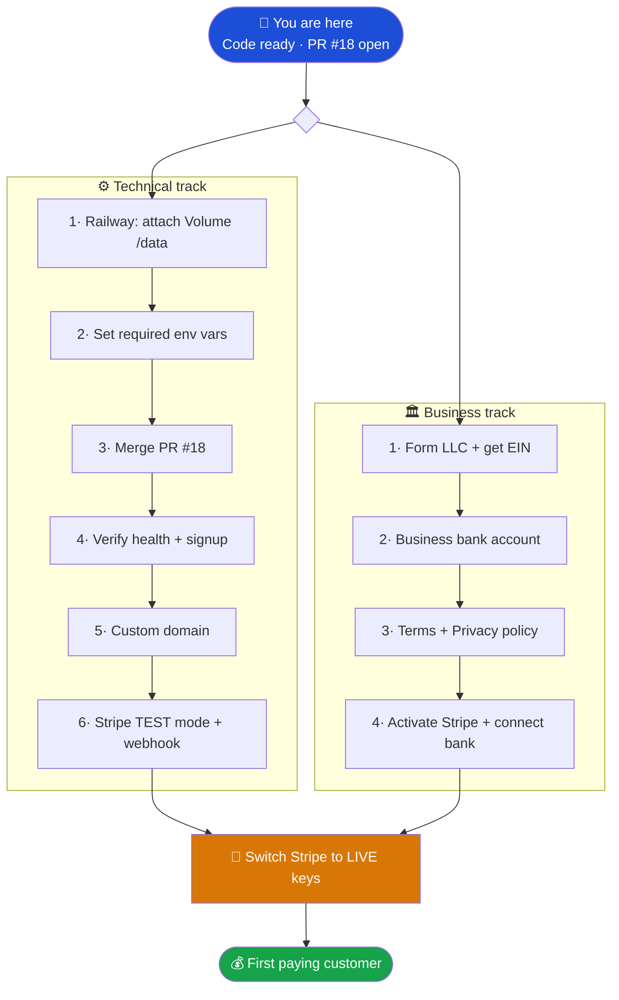
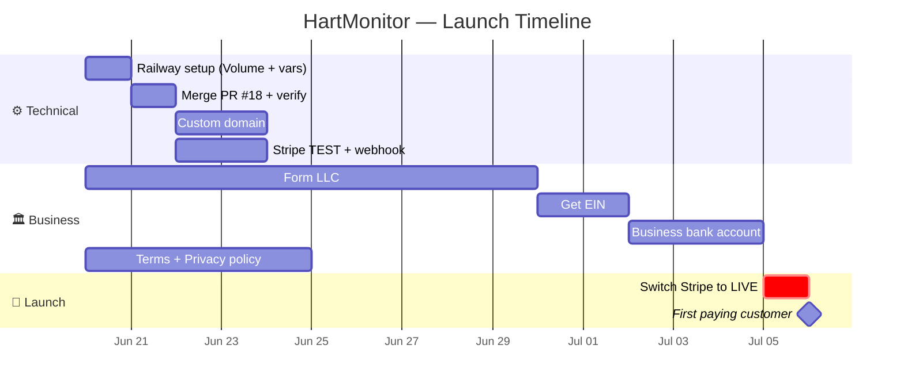

# 🚀 HartMonitor — Master Project Plan

Everything left to take HartMonitor from **"code is ready"** to **"paying
customers."** Two tracks run in **parallel**: a **Technical track** (deploy the
software) and a **Business track** (the legal/money wrapper). They converge when
you switch Stripe to live keys and onboard your first paying customer.

> Click any ▸ section to expand the detailed steps.

---

## 📊 Status dashboard

| Area | Status | Owner |
|---|---|---|
| MES app (all modules, multi-tenant, RBAC) | ✅ Done | — |
| Billing (Stripe, trials, in-code prices) | ✅ Done | — |
| Admin dashboard + data export | ✅ Done | — |
| Safe migrations / no-data-loss updates | ✅ Done | — |
| Backups, health checks, security hardening | ✅ Done | — |
| Tests + CI green | ✅ Done | — |
| **Railway Volume + env vars** | 🟡 To do | **You** |
| **Merge PR #18 → deploy** | 🟡 To do | **You** |
| **Custom domain** | 🟡 To do | **You** |
| **Stripe live activation** | 🟡 To do | **You** |
| **LLC + EIN + business bank** | 🟡 To do | **You** |
| **Terms of Service + Privacy Policy** | 🟡 To do | **You** |

---

## 🗺️ Visual roadmap

---

## 📅 Timeline (parallel tracks)

The technical track is fast (a day or two). The **LLC is the long pole** — start
it now so it's ready by the time the software is live.

---

## ⚙️ Technical track — detailed steps

<b>1 · Railway: attach a persistent Volume</b> 🟡 — CRITICAL, protects all customer data

Without a Volume, Railway **wipes the database on every redeploy**. This is the
single most important step.

- [ ] Railway dashboard → your service → **Settings → Volumes → + New Volume**
- [ ] Mount path: `/data`
- [ ] Save (Railway redeploys automatically)

**Why it matters:** the SQLite database and all backups live on this Volume. It
survives redeploys, so customer data and anything they build is never lost when
you ship updates.

⏱ 5 minutes · 💵 included in Railway plan

<b>2 · Set environment variables</b> 🟡 — the app won't boot without the required ones

Railway → service → **Variables**:

| Variable | Value | Required |
|---|---|---|
| `DATABASE_PATH` | `/data/mes.db` | ✅ |
| `BACKUP_DIR` | `/data/backups` | ✅ |
| `JWT_SECRET` | run: `node -e "console.log(require('crypto').randomBytes(64).toString('hex'))"` | ✅ |
| `SESSION_SECRET` | run that command again (different value) | ✅ |
| `APP_URL` | your final URL (e.g. `https://app.yourdomain.com`) | ✅ |
| `NODE_ENV` | `production` | ✅ |
| `SEED_DEMO_DATA` | `false` | ✅ never `true` in prod |
| `STRIPE_SECRET_KEY` | from Stripe (step 6) | for payments |
| `STRIPE_WEBHOOK_SECRET` | from Stripe (step 6) | for payments |
| `SMTP_*` | from SendGrid | optional |

By design, the server **refuses to start** if `JWT_SECRET`/`SESSION_SECRET` are
missing — so you can't accidentally deploy insecurely.

⏱ 15 minutes

<b>3 · Merge PR #18 → triggers the deploy</b> 🟡

Railway deploys from `main`. All the new work is in **PR #18**.

- [ ] Confirm CI is green on the PR
- [ ] Merge PR #18 into `main`
- [ ] Railway auto-builds (`npm install && npm run build`) and starts
      (`node backend/src/index.js`)

⏱ 5 minutes + ~3 min build

<b>4 · Verify the deploy</b> 🟡

- [ ] Visit `https://YOUR-URL/api/health` → returns `{"status":"ok",...}`
- [ ] Sign up for a test account → you land in the app with a 14-day trial
- [ ] **Redeploy once** and confirm your test account still exists
      (this proves the Volume is working — don't skip it)

⏱ 10 minutes

<b>5 · Custom domain</b> 🟡

- [ ] Buy a domain (e.g. `hartmonitor.io`)
- [ ] Railway → **Settings → Networking → Custom Domain** → add `app.yourdomain.com`
- [ ] Add the CNAME record Railway shows you at your registrar
- [ ] Update `APP_URL` to the new domain → redeploy

⏱ 15 min + DNS propagation · 💵 ~$12/yr

<b>6 · Stripe in TEST mode</b> 🟡 — prove payments work before going live

Full detail in `STRIPE_SETUP.md`. **You do NOT create products/prices — they're
defined in code.**

- [ ] Stripe → copy **test** secret key (`sk_test_...`) → set `STRIPE_SECRET_KEY`
- [ ] Stripe → **Developers → Webhooks → Add endpoint**
  - URL: `https://YOUR-URL/api/webhooks/stripe`
  - Events: `checkout.session.completed`, `customer.subscription.updated`,
    `customer.subscription.deleted`, `invoice.payment_failed`,
    `customer.subscription.trial_will_end`
  - Copy **Signing secret** (`whsec_...`) → set `STRIPE_WEBHOOK_SECRET`
- [ ] Test checkout with card `4242 4242 4242 4242` → confirm the plan upgrades

⏱ 45 minutes

---

## 🏛️ Business track — detailed steps

This is the part the software can't do for you. **Start it now, in parallel** —
the LLC takes the longest. *Not legal advice; consult a professional for your
situation.*

<b>1 · Form an LLC + get an EIN</b> 🟡 — start this first (longest lead time)

**Why:** liability protection (your MES runs customers' production), credibility
with B2B buyers, and clean separation of business/personal money.

- [ ] Choose where to form (your home state is simplest; Delaware is common for
      SaaS but adds a foreign-registration step in your home state)
- [ ] File the LLC:
  - **DIY** via your state's Secretary of State site — ~$50–500, ~30 min
  - **Service** (Northwest, LegalZoom) — ~$100–300 + state fee
  - **Stripe Atlas** — ~$500, sets up entity + EIN + bank guidance in one flow,
    built for SaaS
- [ ] Get an **EIN** from the IRS (free, online, ~10 min) — needed for the bank
      and taxes
- [ ] (Recommended) An **operating agreement**, even for a single-member LLC

⏱ Filing 30 min; **approval takes days to ~2 weeks** depending on state
💵 $50–500

<b>2 · Open a business bank account</b> 🟡

- [ ] Bring your LLC docs + EIN to a bank (or use Mercury/Novo for online SaaS)
- [ ] Keep **all** business revenue/expenses in this account (don't mix with
      personal — it preserves your liability shield)
- [ ] This is the account Stripe pays out to

⏱ 1 hour (instant–3 days to approve) · 💵 often free

<b>3 · Terms of Service + Privacy Policy</b> 🟡 — required because you store customer data

The app already has `/terms` and `/privacy` pages — you just need real content.

- [ ] Generate a draft (Termly, iubenda, or GetTerms) **or** have a lawyer draft it
- [ ] Cover: subscription terms, acceptable use, data ownership (customers own
      their data), data retention (you retain 30 days after cancellation — already
      built), liability limits, and a clear refund policy
- [ ] Replace the placeholder text on the `/terms` and `/privacy` pages
- [ ] Manufacturers may also ask about security — you already have tenant
      isolation, RBAC, audit logging, encrypted-at-rest auth, and data export to
      point to

⏱ 2–4 hours (or a few days with a lawyer) · 💵 $0–500

<b>4 · Activate Stripe + connect your bank + (optional) Stripe Tax</b> 🟡

- [ ] Complete Stripe account activation (business details, EIN, bank account)
- [ ] Connect the business bank account for **payouts**
- [ ] (Recommended) Turn on **Stripe Tax** so sales tax/VAT is calculated and
      collected automatically on subscriptions — saves you major headaches
- [ ] Decide pricing/trial terms (14-day trial is already wired in)

⏱ 1–2 hours + Stripe verification (can take a day)

---

## 🔑 Convergence — going live

<b>Switch Stripe to LIVE keys</b> 🟡 — the moment you can take real money

Only after **both** the technical track (steps 1–6) and business track (steps
1–4) are done:

- [ ] Swap test keys for **live** keys (`sk_live_...` + a new live `whsec_...`)
      in Railway
- [ ] Run **one real low-value transaction** end-to-end and confirm the payout
      lands in your bank
- [ ] You're live. 🎉

⏱ 30 minutes

---

## ✅ Definition of "launch ready" (the minimum)

You can take your first paying customer once all of these are true:

- [ ] Railway Volume attached + `DATABASE_PATH` points to it
- [ ] Required env vars set; `/api/health` returns ok
- [ ] PR #18 merged and verified (signup works, data survives a redeploy)
- [ ] Custom domain live
- [ ] Stripe live keys + webhook working
- [ ] LLC formed + business bank connected to Stripe
- [ ] Real Terms of Service + Privacy Policy published

**Everything else** (SMTP email, Sentry monitoring, mobile apps, a staging
"opt-in updates" environment) is post-launch polish — see `GO_LIVE.md` Phases 5–9.

---

## 🔄 After launch — shipping updates without disrupting customers

Already built and safe (full detail in `UPGRADING.md`):

- **DB changes are additive-only & automatic** — add a numbered `.sql` migration;
  it runs once on deploy inside a transaction. Never drop/rename → existing data
  and anything customers built stays intact.
- **Deploys don't touch data** — the Volume persists across every redeploy.
- **Instant rollback** — Railway → Deployments → Redeploy a previous build; data
  is safe on the Volume.
- **Want customer-approved updates?** Add a staging service (separate Railway
  service + Volume) you promote from. Left out for a simpler launch — say the word
  and I'll set it up.
