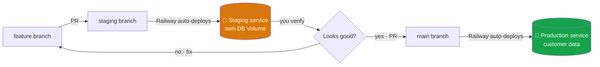
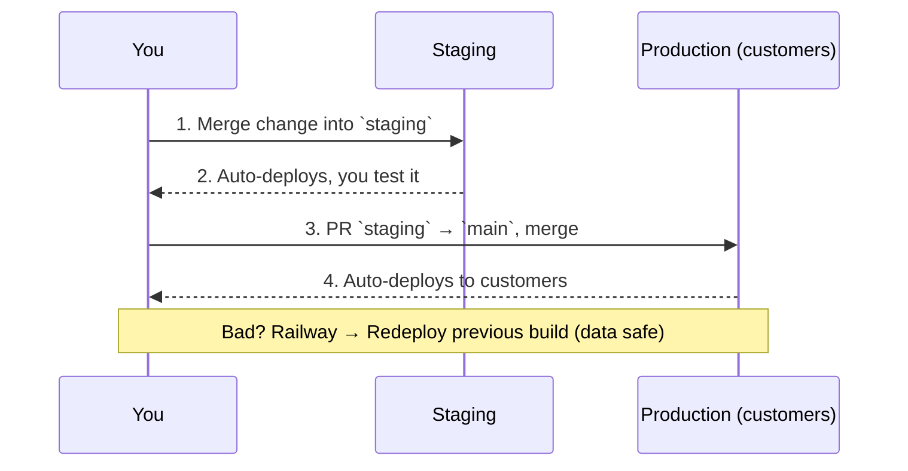

# 🔁 Staging & Controlled Updates

This sets up a **staging environment** so updates never hit your paying customers
until you've verified them. Updates become **opt-in for production**: every change
lands in staging first, you test it, then you promote it to production on your
schedule.

> Note on "per-customer approval": HartMonitor is multi-tenant (one production
> deployment serves all companies), so updates can't be approved by each customer
> individually without giving every customer their own server. The standard,
> sustainable SaaS model — and what this sets up — is **you** gate every update
> through staging before it reaches production. That's the real-world version of
> "customers don't get surprise changes."

---

## How it works

- **Production service** → watches `main` → your real customers.
- **Staging service** → watches `staging` → a safe copy with its **own** database
  Volume and test data. Nothing you do here can touch customer data.

---

## One-time Railway setup

You'll create a **second Railway service** for staging in the same project.

<b>Step 1 · Create the staging service</b>

1. Railway → your project → **+ New → GitHub Repo** → pick this repo again
2. Name it `hartmonitor-staging`
3. **Settings → Source → Branch**: set to `staging`
4. This service now redeploys whenever you push to the `staging` branch

<b>Step 2 · Give staging its own Volume</b> (so it can never touch prod data)

1. Staging service → **Settings → Volumes → + New Volume**
2. Mount path: `/data`
3. This is a separate disk from production — totally isolated

<b>Step 3 · Set staging environment variables</b>

Same as production, but with **staging-safe** values:

| Variable | Value |
|---|---|
| `DATABASE_PATH` | `/data/mes.db` |
| `BACKUP_DIR` | `/data/backups` |
| `JWT_SECRET` | a **different** random value from prod |
| `SESSION_SECRET` | a **different** random value from prod |
| `APP_URL` | your staging URL (e.g. `https://staging.yourdomain.com`) |
| `NODE_ENV` | `production` |
| `SEED_DEMO_DATA` | `true` ← OK in staging; gives you demo data to test with |
| `STRIPE_SECRET_KEY` | Stripe **test** key (`sk_test_...`) — never live keys in staging |
| `STRIPE_WEBHOOK_SECRET` | staging webhook secret |

⚠️ Staging must use **Stripe test keys only**, so you never accidentally charge a
real card while testing.

<b>Step 4 · (Optional) Health-check automation</b>

GitHub will run a health check after each deploy if you set repo variables
(Settings → Secrets and variables → Actions → **Variables**):

- `STAGING_URL` = your staging URL
- `PROD_URL` = your production URL

If unset, the checks skip cleanly — nothing breaks.

---

## Your update routine (every change, from now on)

1. **Build on a feature branch**, open a PR into `staging`.
2. CI must be green, then merge → Railway deploys to **staging**.
3. **Verify on staging** (the demo data + Stripe test mode let you click through
   billing, new features, migrations — all without risk).
4. When happy, open a PR **`staging` → `main`** and merge → Railway deploys to
   **production**.
5. Anything wrong in prod? Railway → **Deployments → Redeploy** a previous build.
   Customer data is untouched (it lives on the production Volume).

---

## Why this is safe for customer data

- **Schema changes are additive-only** and run automatically on deploy, inside a
  transaction (see `UPGRADING.md`). They never drop or rename — so existing data
  and anything customers built survives every update.
- **Staging has its own Volume** — testing migrations there proves they're safe
  before they ever run against production.
- **The production Volume persists across deploys** — shipping new code never
  resets the database.

---

## TL;DR

| | Production | Staging |
|---|---|---|
| Branch | `main` | `staging` |
| Who uses it | Real customers | Only you |
| Database | Real customer data (own Volume) | Throwaway demo data (own Volume) |
| Stripe | Live keys | Test keys only |
| Purpose | Stable, gated releases | Verify before promoting |
